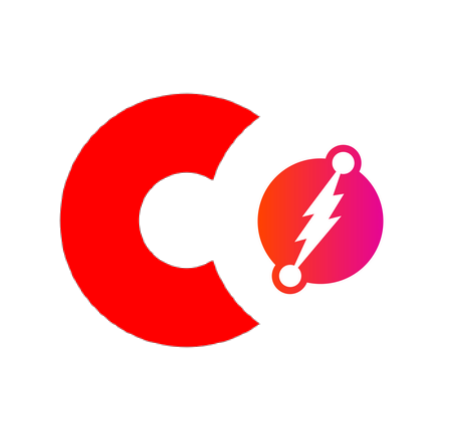

{height=300px width=300px}

#CGraph - Corda & The Graph

CGraph is a simple connector library that allows you to pipe verified data from Corda into a GraphQL server and database, over HTTP. 

This means you can transact across trust boundaries, with Corda for safe, secure and provable data but also,
 read via GraphQL for federation, flexibility, and more.

## Do I need this?

* Does your data model exhibit high levels of connectedness?
* Do you need a unified, flexible API for both reading and writing on and off-ledger data?
* Do you wish to work with the latest graph tooling and methodologies? e.g GraphQL, GraphDBs.

## Quick start

Include the `cgraph-core` module as a dependency inside your `build.gradle`
Add this to your Cordapp’s Gradle dependencies:

```groovy
dependencies{
    // Corda dependency
    cordapp "com.github.mcevoyinit.cgraph:cgraph-core:1.0-SNAPSHOT" 
} 
```  

    
