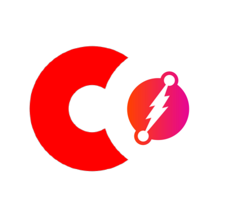
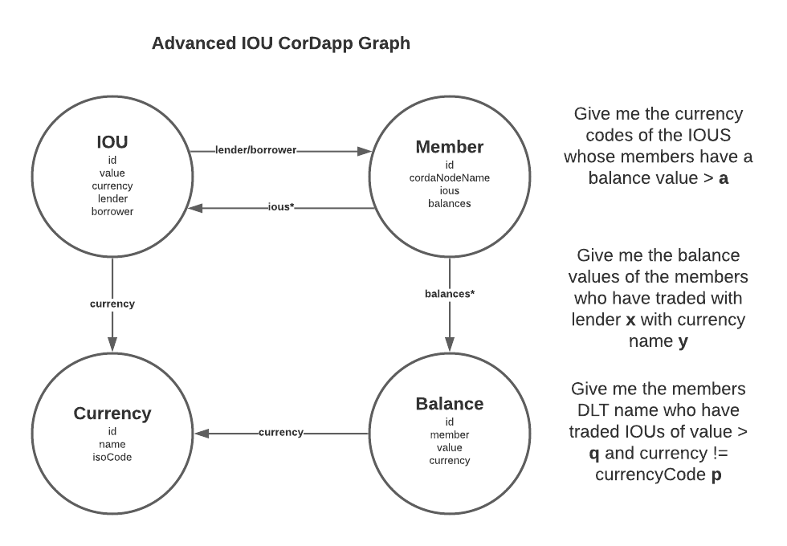

#CGraph - Corda & The Graph

CGraph is a soon-to-be released library that allows you to pipe verified data from Corda into a GraphQL server and database, over HTTP. 

This means you can transact across trust boundaries, with Corda for safe, secure and provable data but also,
 read via GraphQL for federation, flexibility, and more.

###Modules

3 modules within the library currently

####```cgraph-core```

The core lib. Inside this cordapp middleware, there are various classes and services which aim to do as much work as possible for the CGraph user cordapp. It contains:

-`GraphableState` which extends `LinearState` and `QueryableState`. User states must extend this and implement the `buildEntityMap()` function.
 This function returns a property map which cgraph will use to generate mutations for the graph.
  Not all state properties need to be in here except the ones that are needed to be coherent with the state’s corresponding schema entity. 
  This is the translation point for the Corda LDM and the Graph LDM. 
  `GraphableSchema` : `LinearState` is used solely by cgraph under the hood to perform a commit to the graph.
´´
    interface GraphableState : LinearState,  QueryableState {
        /**
         * @return [MapOfMaps] representation of the implementing contract state.
         * This map is used by CGraph to generate mutations in order to write persisted states to the graph db instance.
         * Future enhances may offer more niche annotation support to better track relationships across state model and graph entities.
         */
        fun buildEntityMap(): MapOfMaps
    }

- `CGraphService` is the heart of cgraph. This service detects new ledger entries of type `GraphableState` and transforms them by passing the result of the `buildEntityMap()` function into the generator.

- `GraphQLMutationGenerator` generates a mutation based on the shape of the provided state property map. More details to be provided here but it can detect based on the presence of UUID type if a nested mutation is needed to write a separate entity.

- `GQLClient` is then used to write the mutation over HTTP to the graph.
 
#### `cgraph-example`

- This model takes CGraph beta “out for a spin” declaring it as a dependency.
- It extends the IOU CorDapp and making it “graphable” by using the SDK.
- You should follow this example to get your own CorDapp up and running.
- The Graphable IOU Cordapp Logical Data Model looks like:



#### `cgraph-js`

- This is the client server, it uses  Cordite Braid JS client, among other items like dgraph lamda servers. 
- The sample JS lives in here now also but future versions will seek to provide an NPM package to support user clients.
- 

#### Solution Arch

Here's the target cgraph solution architecture V1


1. The NodeJS runtime is the user entry point to the system for most reads and writes. 
Data to write is received from the user browser/client by a braid.js client and forwarded over HTTP to an embedded braid web server running in the CorDapp.
 I chose Braid so that its JS client could live inside a DGraph “Lambda” server Dgraph Lambda Overview - GraphQL. 
My sense is there will be interesting synergy between Lambdas and Corda JS clients. 
Lambda provides a way to write your custom logic in JavaScript, integrate it with your GraphQL schema, and execute it using the GraphQL API in a few easy steps.
 Looking back to the flipped tiered business programming model earlier in the paper, the lambda server is now layer 3 with DGraph and Corda being layer 2. This means

A single API endpoint for the whole Corda solution

A selling point of GraphQL is being able to have all the API access at a single URL. That’s right, not different ports or even endpoints, but the same exact endpoint for both queries and mutations (read and writes), for everything. The GraphQL syntax defines for each HTTP request whether it is a query (default if not specified) or a mutation. It would be similar in theory to having a single SQL endpoint connection to run either SELECT statements and INSERT/UPDATE/DELETE statements.
So by being able to have a custom mutation/query you can do multiple actions in a single request to a single API. For example, we could set up a lambda to write to Corda and write an expected txn ID in DGraph, all in a single mutation operation, this could be useful for reconciliation and logging. There is still way more to it than this.

Corda flows are invoked, transactions write data to the ledger in a way that is protected by contracts, as normal. After the fact, once the data is successfully recorded, it is replicated into DGraph over HTTP via the CGraphService. This service currently subscribes to rawUpdates to detect GraphableStates. It then uses the CGraphMutationGenerator to generate the corresponding GraphQL mutation which is sent over  HTTP by the GQLClient. Multi-state transactions resolve coherently in the graph when the correct paradigm is followed, something I’ll expand on later. A two-phase commit can be used here to increase consistency, which is the main reason GraphableState would extend QueryableState.

Data enters DGraph. The same NodeJS runtime from 1. can then fetch data via GraphQL and serve data in UIs out to the browser via React. 

Alternatively, raw data can be queried from DGraph via GraphQL or HTTP consoles/clients. My favourite tool for this is GraphiQL Online  

## Set up your graph
You need to specify the GraphQL server that CGraph will connect to. 
I chose DGraph as a first integration since the GraphQL server and KV store are in one process. However any GraphQL server should work. 
You can set up DGraph locally or remote, for each node.

###Remote
DGraph has a free, one click deployable, instance that's super easy to get set-up `https://cloud.dgraph.io/`. I use two premium instances for the demo and test. I'll add a version that works with a single instance for development convenience in future.

###Locally 

`Golang binaries` set up golang and fetch them at https://dgraph.io/downloads

 ```
$GOPATH/bin/dgraph zero
$GOPATH/bin/dgraph alpha --port_offset 1
```
#### Docker

```docker run --rm -it -p "8080:8080" -p "9080:9080" -p "8000:8000" -v ~/dgraph:/dgraph "dgraph/standalone:v21.03.0"```
  
 
Edit the URL and Auth Token in `deployCGraph` gradle task in root `build.gradle`
You can also edit the testing config in `CGraphIOUDriverTesting` to run the sample driverdsl test.
This is the URL Corda will write to and, the URL the client will read from. 

### Running CGraph
Hit a terminal in the project root directory:
```
./gradlew clean deployCGraph
./build/nodes/runnodes
```
This brings up 3 nodes (Lender, Borrower and a Notary)

You then need to connect each Nodejs client to its corresponding node
```
cd cgraph/cgraph-js/
node.js iou-client.js 3000 8080
// new terminal tab
node.js iou-client.js 3001 8081
```


fjsdfkj  adfsadf

- You can interact with this HTTP API by using the Insomnia HTTP client json script `CGraphInsomnia.json` in the `resources/scripts` folder.
- The order in which you seed the data should go like this:
    - `Member` goes directly into each nodes graph, not the ledger
    - `Currency` written to ledger and then graph via lib. Hit node.js server over http.
    - `Balance` written to ledger. References currency and holder member, from above
    - `IOU` written to ledger. References all of above. IOU in both ledgers and graphs. 

In future versions, I'd like write a more modular architecture for extending and integrating with more graph types, for example:

    cgraph-cordapp 
    cgraph-client
    cgraph-schema-generator 
    cgraph-testing
    cgraph-sample-client
    cgraph-sample-cordapp
    
