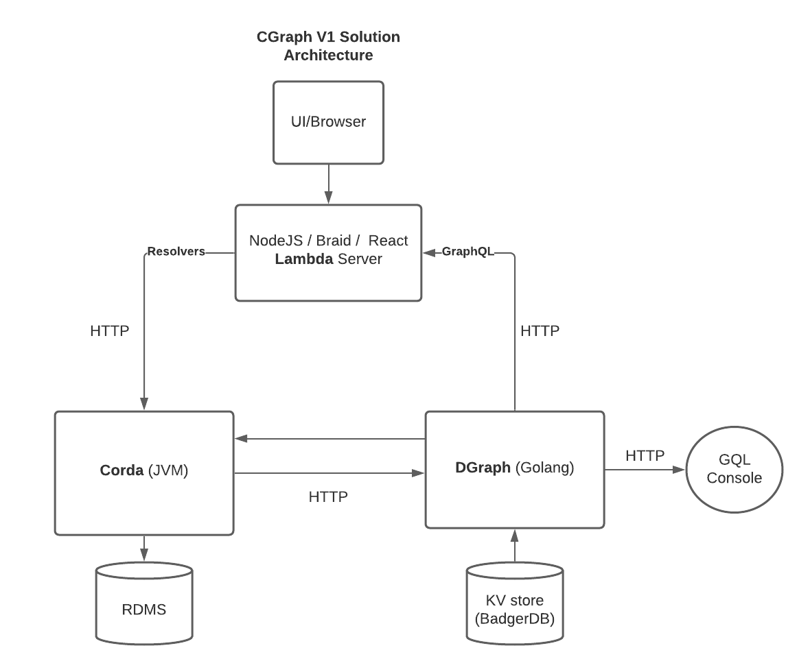

One CGraph solution architecture could take a triangular form. There are many permutations of this but here is one that may be useful to some use-cases.



##The Entry Point 
 This NodeJS runtime is the entry point to the system for most reads and writes. Data to write is received from the user browser/client over HTTP. Then a Braid.js client and forwards the write request, again over HTTP, to an embedded Braid web server running inside Corda. 
 
I chose Braid so that its JS client could live inside a [DGraph “Lambda” server](https://dgraph.io/docs/graphql/lambda/overview/).

My sense is there could be a unique synergy between DGraph Lambdas and Corda JS clients. 
Lambda provides a way to write your custom logic in JavaScript, integrate it with your GraphQL schema, and execute it using the GraphQL API in a few easy steps. 
Looking back to the flipped tiered business programming model earlier in the paper TODO, the lambda server is now layer 3 with DGraph and Corda being layer 2. 

A selling point of GraphQL is being able to have all the API access at a single URL. That’s right, not different ports or even endpoints, but the same exact endpoint for both queries and mutations (read and writes), for everything. 
The GraphQL syntax defines for each HTTP request whether it is a query (default if not specified) or a mutation. It would be similar in theory to having a single SQL endpoint connection to run either `SELECT` statements and `INSERT/UPDATE/DELETE` statements.
So by being able to have a custom mutation/query you can do multiple actions in a single request to a single API. 

The idea of arriving at a single system API endpoint for all Corda solutions, read and write is interesting. I'm currently working on this:

```
type Mutation {
   invokeFlow(flowName: String!, params: Any!): ID! @lambda
}   
```

These custom resolvers can be taken further. We could, for example, set up a lambda to do the following in a single mutation operation,

 1. Write an expected transaction ID in DGraph, perhaps alongside a subscription
 2. Write to Corda, which then writes to DGraph
 3. Have DGraph give us thumbs up when the expected transaction id is written, by Corda.
 4. Give user confidence that stores are consistent, in the single request
 
This could be useful for reconciliation and logging. There is a more to it than this.

## Writing

Corda flows are invoked, transactions write data to the ledger, protected by smart contracts, as normal.
After the fact (more detail to be provided on guarantees here), once the data is successfully persisted, it is replicated into the Graph, over HTTP, by the `CGraphService`. 
This service currently subscribes to `rawUpdates` to detect `GraphableStates`. As mention, it then uses the `CGraphMutationGenerator` to generate the corresponding GraphQL mutation which is sent over HTTP by the `GQLClient`. 

Multi-state transactions resolve coherently in the graph when the correct paradigm is followed, something I’ll expand on later. 
A two-phase commit can be used here to increase consistency, which is the main reason `GraphableState` would extend `QueryableState`.

##Reading

Data enters DGraph. The same NodeJS runtime from 1. can then fetch data via GraphQL and serve data in UIs out to the browser via React. 

Alternatively, raw data can be queried from DGraph via GraphQL or HTTP consoles/clients. My favourite tool for this is [GraphiQL Online](https://github.com/graphql/graphiql). 