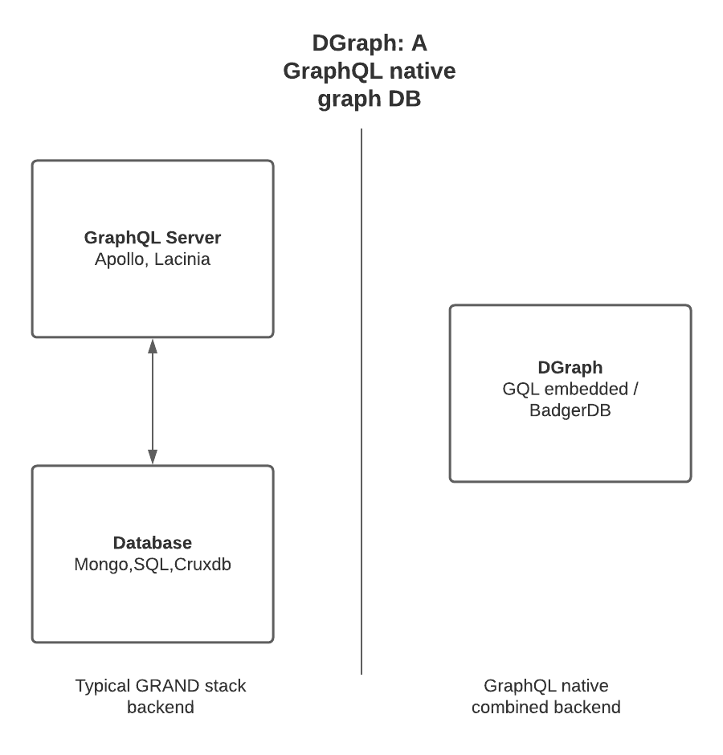

DGraph is the graph technology that interests me the most. 

Although the CGraph Library will be architected in future to support many graph databases, 
I chose DGraph as a first case study run. 
DGraph is my personal favourite graph database. 
The main reasons for the decision will become clear:

DGraph - “Distributed Graph Database” is a GraphQL native distributed graph database that is written from the disk to the top-level query interface by DGraph labs in California.
 
>>DGraph is a curve jumper. It does distributed transactions, low-latency arbitrary depth joins, traversals, provides synchronous replication and horizontal scalability — with a simple GraphQL-like API -  [DGraph Labs](https://www.dgraph.io)

###Graph Native
DGraph is unique in that it has a GraphQL server natively embedded in the database process, alongside its graph DB / KV store. This is interesting because:

Typically the GraphQL server lives separately from the underlying datastore, as illustrated below. 
Having an all-in-one service greatly speeds up development effort, lowers maintenance cost, and solution complexity, which is the primary reason DGraph is CGraphs first integration.

{height=500px width=500px}

Furthermore, this removes the need for writing and maintaining a GraphQL server, resolvers, and middlewares. 
Maintaining a separate graph server and database processes is heavy-duty!

### Data storage & Retrieval

DGraph provides a novel solution to the N+1 query problem. Data is shared based on the relationship instead of the entity type. 
This combined with a sharding mechanism then groups RDP triples into KV lists means we can fetch relationships / perform join queries across the cluster in less network calls.
This also means the latency is the query is function of the *query depth* as opposed to the **number of records in the search space**. 
These features enable DQL, a GQL extension that is optimised for the KV storage, BadgerDB. 

 
##GRAND development stack
There are various layouts which are typically referred to as the GRAND development stack. 
GRAND stack is a full-stack development integration for building graph-based applications. 
GRAND stands for the following technologies:

- **GraphQL** - a query language for APIs and a runtime for fulfilling those queries with your existing data. Relay is a popular example.
- **React** - a JavaScript library for building user interfaces
- **Apollo Client** - a fully-featured, production-ready caching GraphQL client for every server or UI framewor
- **Neo4j Database** - a graph database that is ACID-compliant and built to store and retrieve connected data

DGraph allows a leaner version of the GRAND stack since the database layer and the GraphQL server layer come bundled in one product. Full-stack development on DGraph requires fewer technologies

- **DGraph** - ACID-compliant native GraphQL database with graph backend
- **React**  - build user interfaces and reusable components as normal
- **Apollo Client** - - GraphQL client can speak directly to your DGraph instance.

Another example of the GQL server and db pairing is:

 - **Lacinia** - GraphQL server written in Clojure by Walmart Labs Lacinia - GraphQL for Clojure
 - **Crux** - Bitemporal Graph DB written in Clojure. Crux  

Pairings like the above will be considered in future version. They may be better suited to larger Corda deployments.
The creators of Crux have written a Crux-Corda Connector CorDapp juxt/crux-corda  
