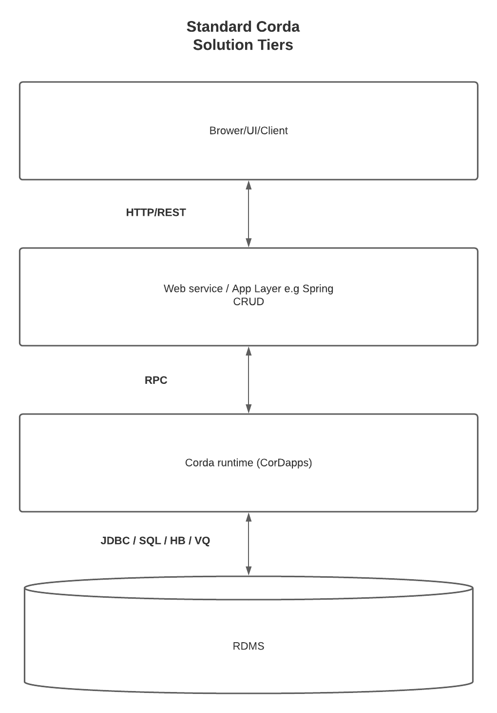
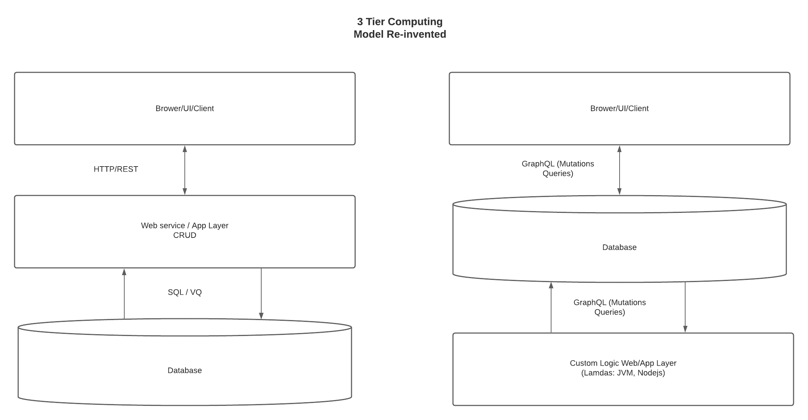

From a Corda solutions engineering perspective, we must consider the productivity of various actors in the Corda software engineering life cycle in order to increase the likelihood of project success. 
From a Corda perspective, we typically see an extended 4 tier business programming architecture. 

{height=350px width=350px}


Many community thought leaders have sought to automate this to improve the lives of CorDapp developers. 
We saw this succinctly summarised in a blog post by Bond 180 [Corda integration options in 2020](https://www.corda.net/blog/corda-integration-options-in-2020/)


## Classic tier qualms

This paradigm frequently comes at a high cost.

- Even though it’s Corda, the pattern we all use is more or less CRUD. 
CRUD is clunky and requires special effort to give me the access and data points I want in a query.  

- Often I just want to display what’s in the database on my screen. 
Why does the database have to be in the bottom layer?
 We certainly don’t want to stick DSL SQL in our client. It’s not within frontend vernacular to talk to SQL db.

```
The questions every new developer asks themselves can finally be raised again.

Why can’t my view layer talk directly to my data layer? 
Could we talk directly to the database?

For that there would need to be an API "in" the database. 
```

- Furthermore, why do I need to write, deploy and maintain intermediate, “middle man” relay layers?
I am constantly writing modifying and maintaining CRUD layers yet making changes in this 4 tier setup can be troublesome. 
UIs break, web-server endpoints suddenly don’t work, packages, like RPC clients, need to be recompiled.
 Of course, this can all be automated but, it is still prone to brittleness.
Backend changes often lead to cascading breakages on other teams components. 
It can be stressful for backend team be “one sprint ahead” of other roles e.g front end, test, data engineers.

```
Could the web service be left for custom business logic? 
```

- For this to manifest, teams need a common data contract of reference and that they can work in parallel against.

## Schema driven programming

- DGraph flips the classic tiered model around which could yield high productivity gains.

{height=800px width=800px}

- Once we define the data model via the schema, DGraph can consume this and generate the CRUD API for us. 
This CRUD API is adjusted as the schema is adjusted. Front end and backend developers get to go to work straight away, in parallel against a common contract of reference. This alone is a key differentiator of DGraph.

- We move the DB from layer 3 to layer 2. We then need a DSL that is native to browser/clients to talk directly to the new layer 2 db. 
GraphQL fits the bill. Many say GraphQL is the future DSL of the internet. It is easy to work with and use in the browser/mobile and client/server environments. 
It enables us to talk to DB directly.  

- It gets even better. From the client, we don’t have to worry about knowing whether to talk to the DB or the webserver. 
Custom GraphQL queries and mutations, also defined on the schema, can inform the database server when to call them versus calling queries that talk directly to the DB. 

- DGraph lambdas provide Nodejs (JVM support coming this summer) to call externally. This is where we can start Corda flows over JSON RPC. 
The sample uses Cordite Braid at the moment for it's JS client.
I expand on this in this lambda piece in the solution architecture section but please keep the “new” layer 3 in mind. This is where we move towards the unified system read/write interface.

