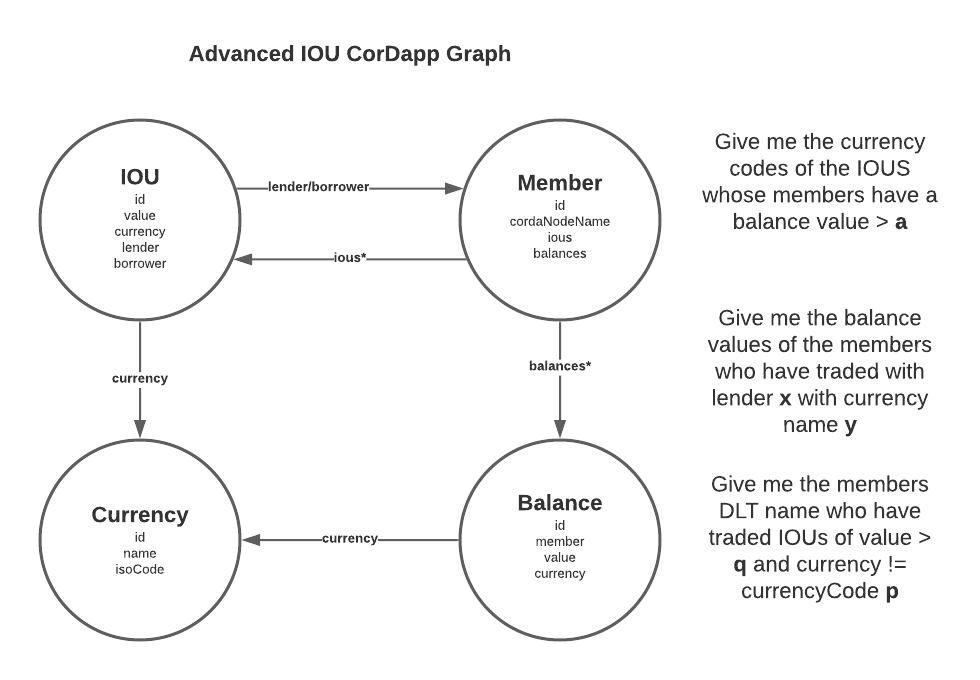

- This example takes CGraph beta “out for a spin” consuming it as a CorDapp dependency.
- It extends the IOU CorDapp and making it “graphable” by using the SDK.
- You should follow this example for inspiration on getting your own CorDapp up and running.


### Example CorDapp
#### Data Model
Let’s consider an extended version of the classic sample IOU CordDapp data model. 
Even in a simple four-state data model like this, there are many relationships and ways of approaching the data model 
depending on the questions you want to answer. Diving in:

#### IOU Logical Data Model

{height=600px width=600px}

An `IOU` entity represents a loan between a lender and a borrower, each of which is a `Member` entity. Each `IOU` has a unique ID, an integer value and a currency type, which is also a separate entity, `Currency`. 

`Member` entities also have a unique ID and a cordaNodeName of type string. We can model a bilateral or “inverse” relationship by also saying that each `Member` holds a list of the ious it has lended and borrowered.

`Member` holds a `Balance` entity, inversely a `Balance` would have a holder `Member`. A Balance object exists per `Currency` and also, separately, an `IOU` can record a `Currency`

#### IOU GraphQL Schema

The entity definition. This will nearly always be a 1-1 mapping of the properties and primitive types from the `GraphableState`.
 Some entities may only exist in the graph and not as states. 
 There are plans to create a `GraphMapState` where maps can be stored raw in a contract state property.

Relationships between entities are marked explicitly as types in the schema. 

Annotations like `@hasInverse(field “field_on_related_entity”)` allow you to mark relationships. There are many more annotations possible, which I’ll expand on soon. 

```
type IOU {
  id: String! @id
  value: String!
  currency: Currency!
  lender: Member!
  borrower: Member!
}

type Member {
  id: String! @id
  cordaNodeName: String @search(by: [hash])
  borrowed: [IOU] @hasInverse(field: "borrower")
  lended: [IOU] @hasInverse(field: "lender")
  balances: [Balance] @hasInverse(field: "holder")
}

type Balance {
  id: String! @id
  holder: Member,
  value: String
  currency: Currency
}

type Currency {
  id: String! @id
  name: String @search(by: [hash])
  isoCode: String @search(by: [hash])
}
```
## State - Entity Mapping

```
@BelongsToContract(IOUContract::class)
data class IOUState(val value: Int,
                    val currency: UUID,
                    val lender: Party,
                    val lenderMemberId: UUID,
                    val borrower: Party,
                    val borrowerMemberId: UUID,
                    override val linearId: UniqueIdentifier
) : GraphableState {

    //** The public keys of the involved parties. *//
    override val participants: List<AbstractParty> get() = listOf(lender, borrower)

    override fun buildEntityMap(): MapOfMaps {
        return mapOf(
            "entityType" to "IOU",
            "id" to linearId.id.toString(),
            "value"  to value,
            "currency" to currency,
            "lender" to lenderMemberId,
            "borrower" to borrowerMemberId
        )
    }
}
```

## Flows
There are 4 flows in the CorDapp

TODO

## Braid
The example CorDapp contains a `IOUBraidServer`. Future enhancements may create this server for you based on `GrapableFlow` extensions.

## Testing

E2E Integration test can be found at `CGraphIOUDriverTesting`

```
@Test
fun `graph enabled advanced iou cordapp e2e processing`() {
    driver(DriverParameters(
        startNodesInProcess = true,
        networkParameters = testNetworkParameters(minimumPlatformVersion = 4, notaries = emptyList())
    )) {
        val (lender, borrower) = listOf(
            startNode(
                parameters = NodeParameters(
                    providedName = DUMMY_LENDER_NAME,
                    rpcUsers = listOf(user),
                    additionalCordapps = setOf(
                        CGraph.Cordapps.Example.withConfig(
                            mapOf(
                                "braidServerPort" to 9090
                            )
                        ),
                        CGraph.Cordapps.Core.withConfig(
                            mapOf(
                                "graphQLUrl" to DGRAPH_URL_LENDER,
                                "graphQLToken" to DGRAPH_TOKEN_LENDER,
                                "graphBraidServerPort" to 8080
                            )
                        )
                    )
                )
            ),
            startNode(
                parameters = NodeParameters(
                    providedName = DUMMY_BORROWER_NAME,
                    rpcUsers = listOf(user),
                    additionalCordapps = setOf(
                        CGraph.Cordapps.Example.withConfig(
                            mapOf(
                                "braidServerPort" to 9091
                            )
                        ),
                        CGraph.Cordapps.Core.withConfig(
                            mapOf(
                                "graphQLUrl" to DGRAPH_URL_BORROWER,
                                "graphQLToken" to DGRAPH_TOKEN_BORROWER,
                                "graphBraidServerPort" to 8081
                            )
                        )
                    )
                )
            )
        ).map { it.getOrThrow() }

        val member1id = UUID.randomUUID().toString()
        val member2id = UUID.randomUUID().toString()

        val borrowerParty = borrower.nodeInfo.legalIdentities.first()

        println("Dropping data from graphs databases")
        borrower.rpc.startFlowDynamic(DropGraphDataFlow::class.java)
        lender.rpc.startFlowDynamic(DropGraphDataFlow::class.java)

        println("Writing Members to Graph")
        lender.rpc.startFlowDynamic(
            PostGraphQLFlow::class.java,
            UPSERT_MEMBER_GQL(
                id = member1id,
                cordaNodeName = lender.nodeInfo.legalIdentities.first().name.graphableString()
            ),
            GraphQLRequestType.MUTATION
        )
        lender.rpc.startFlowDynamic(
            PostGraphQLFlow::class.java,
            UPSERT_MEMBER_GQL(
                id = member2id,
                cordaNodeName = borrower.nodeInfo.legalIdentities.first().name.graphableString()
            ),
            GraphQLRequestType.MUTATION
        )

        borrower.rpc.startFlowDynamic(
            PostGraphQLFlow::class.java,
            UPSERT_MEMBER_GQL(
                id = member2id,
                cordaNodeName = borrower.nodeInfo.legalIdentities.first().name.graphableString()
            ),
            GraphQLRequestType.MUTATION
        )

        borrower.rpc.startFlowDynamic(
            PostGraphQLFlow::class.java,
            UPSERT_MEMBER_GQL(
                id = member1id,
                cordaNodeName = lender.nodeInfo.legalIdentities.first().name.graphableString()
            ),
            GraphQLRequestType.MUTATION
        )

        println("Writing Currency to Ledger and Graph of both parties")
        lender.rpc.startFlowDynamic(IssueCurrencyFlow::class.java,"Pound Sterling", "GBP", listOf(borrowerParty)).returnValue.getOrThrow()

        print("Wait for entry to reach both lender and borrower graphs")
        Thread.sleep(1000)

        lender.verifyCurrency("GBP")
        borrower.verifyCurrency("GBP")

        print("Issue balance into both ledgers and thus graphs")
        lender.rpc.startFlowDynamic(IssueBalanceFlow::class.java,"GBP", 100000).returnValue.getOrThrow()
        borrower.rpc.startFlowDynamic(IssueBalanceFlow::class.java,"GBP", 0).returnValue.getOrThrow()

        lender.verifyBalance("Pound Sterling", "GBP", 100000)
        borrower.verifyBalance("Pound Sterling", "GBP", 0)

        print("Wait for balance entry to reach both lender and borrower graphs")
        Thread.sleep(1000)

        print("Writing IOU to both ledgers and graphs, with updated balances in both also")
        lender.rpc.startFlowDynamic(IssueIOUFlow::class.java, 50000, "Pound Sterling", borrowerParty).returnValue.getOrThrow()

        // Lender balance deducted. Borrower balance credited
        lender.verifyBalance("Pound Sterling", "GBP", 50000)
        borrower.verifyBalance("Pound Sterling", "GBP", 50000)
    }
}
```
Where assertions can be done by querying the vault, the graph, or both using `NodeHandle` extension functions.
```
fun NodeHandle.verifyIOU(name: String, isoCode: String, value: Int) {
    rpc.startFlowDynamic(PostGraphQLFlow::class.java,
        """
          query {
            queryBalance(filter: {
                value : { eq : "$value" }
            }) {
             currency(filter: 
                {
                    isoCode: { eq: "$isoCode" },
                and : {
                    name: { eq: "$name" }
                }
              }
            ){
              id
            }
            id
          }
        }
        """.trimIndent(),
        GraphQLRequestType.QUERY
    ).returnValue.getOrThrow().also {
        assertNotNull(it, "Currency $isoCode not present in graph")
    }
}
```
`
